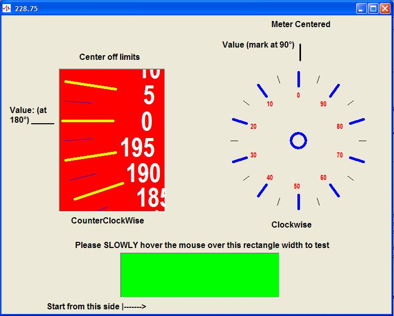



## Rotating VU meter

### Description

displays a value on a graphical rotating VU meter
 
### More Info
 
a value, and several parameters (see the code)

check the code remarks

value displayed in theVU meter

             |
---                |---
**Submitted On**   |2010-01-07 16:32:46
**By**             |[Ivan Enriquez](https://github.com/Planet-Source-Code/PSCIndex/blob/master/ByAuthor/ivan-enriquez.md)
**Level**          |Intermediate
**User Rating**    |5.0 (30 globes from 6 users)
**Compatibility**  |VB 6\.0
**Category**       |[Graphics](https://github.com/Planet-Source-Code/PSCIndex/blob/master/ByCategory/graphics__1-46.md)
**World**          |[Visual Basic](https://github.com/Planet-Source-Code/PSCIndex/blob/master/ByWorld/visual-basic.md)
**Archive File**   |[Rotating\_V217213172010\.zip](https://github.com/Planet-Source-Code/ivan-enriquez-rotating-vu-meter__1-72808/archive/master.zip)

